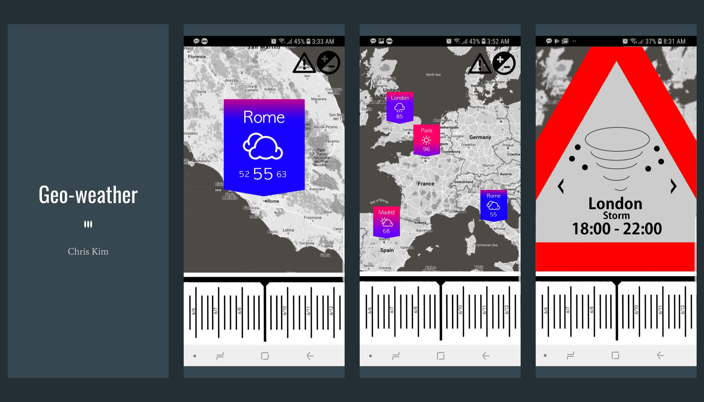
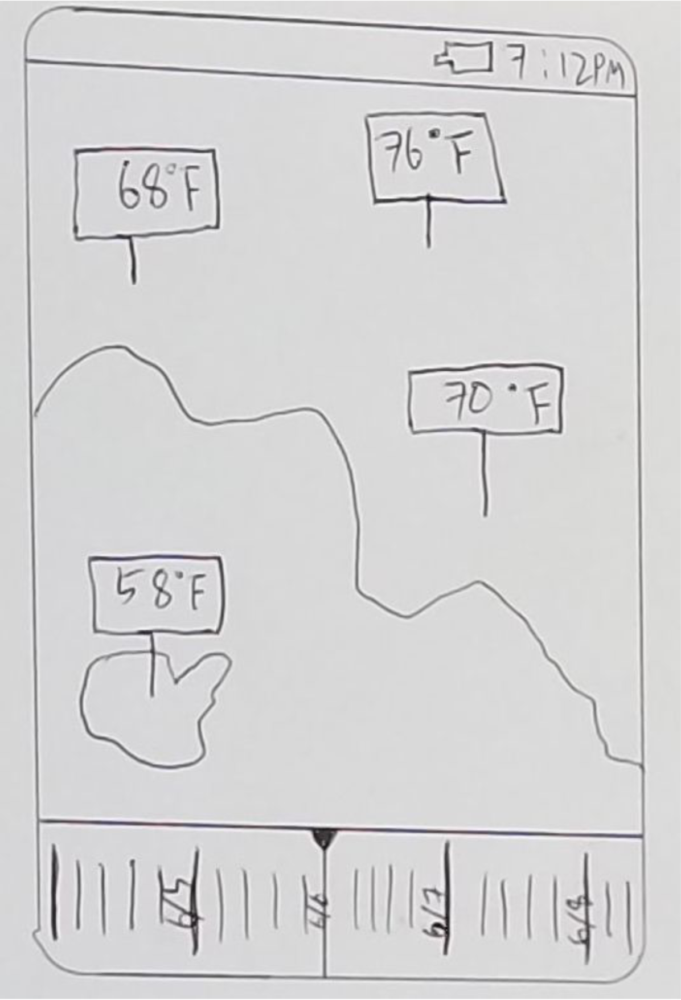
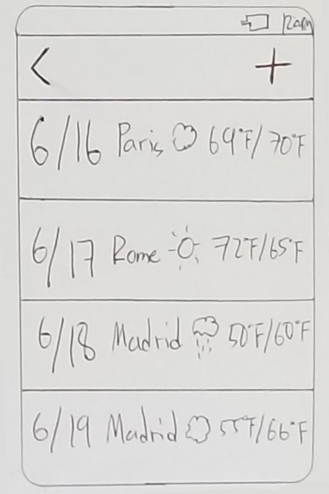
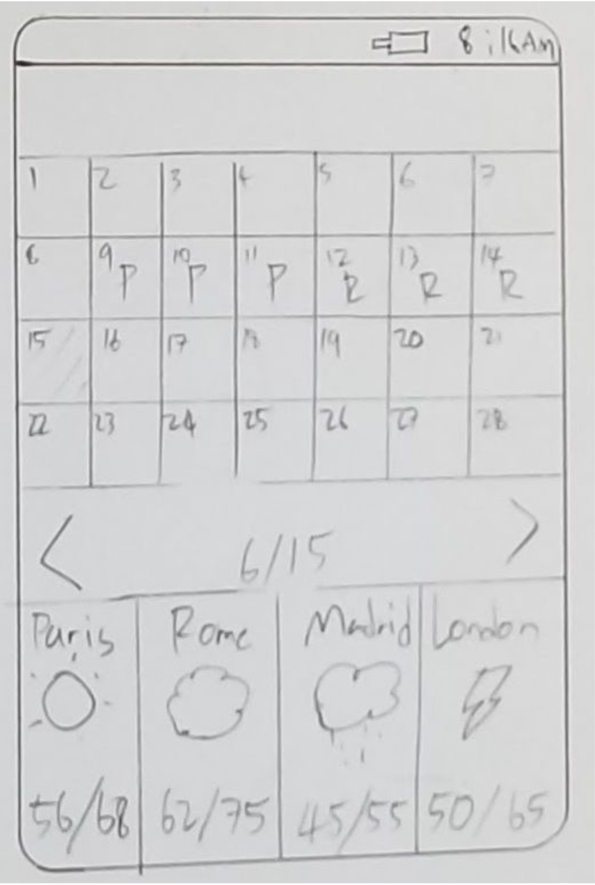
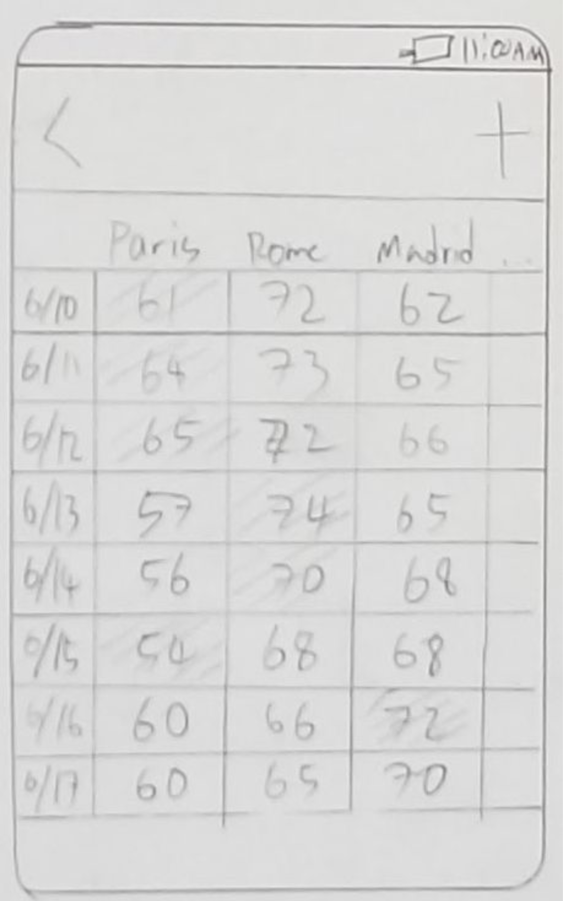
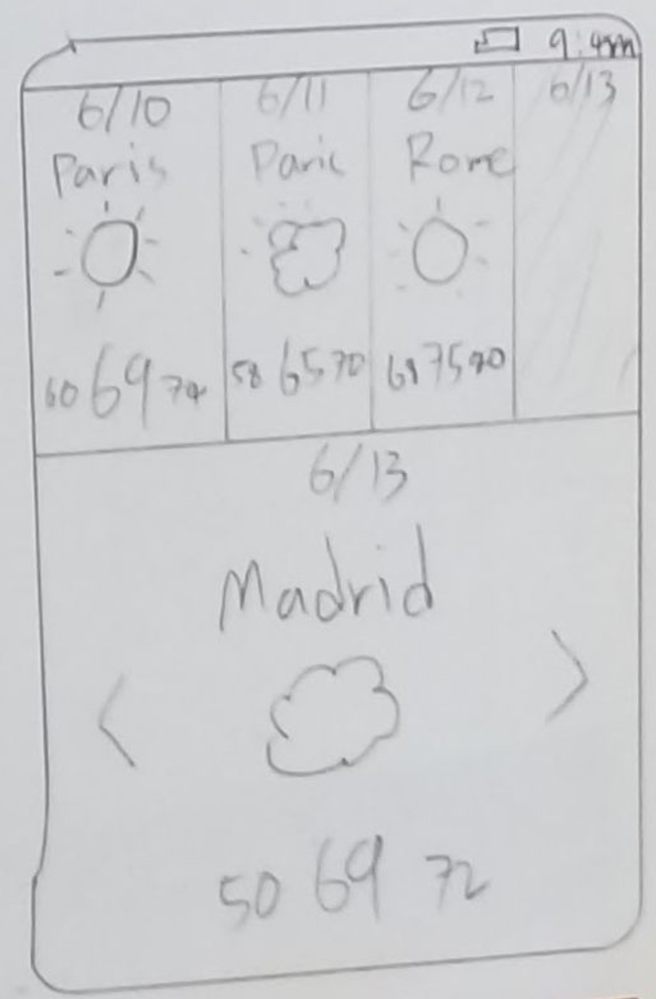
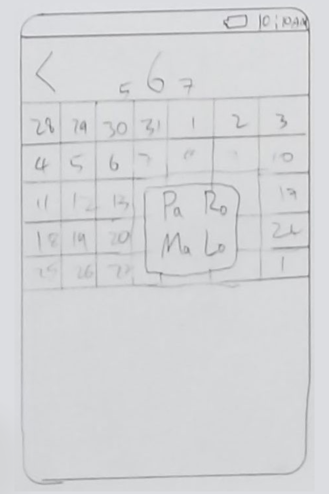
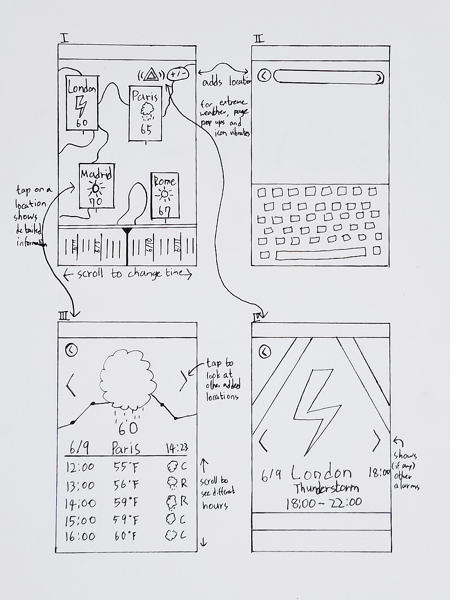

# UIUX Project: Geo-Weather
<!--finished product design-->

  
Weather application with minimal design. Geo-weather compares weather
of several locations in one screen, while taking time into consideration. The time bar at the
bottom allows maneuvering in time period to see weather change of all locations.
Application also provides information on extreme weather in a pop-up form, and can revisit
the alarms even after dismissing it.

## Design Brief (The Need)
You’ve been hired by an travel company (CANOE) to create a mobile weather application specifically suited for travellers. In advance, the company has determined the relevant situations, tasks and users (STUs). You will engage in an iterative design process to create an application that supports these situations and tasks for one of the two candidate users.

* **Situations**
  1. In the morning, a user considers the weather forecast to prepare for their outing and decide where to go that day.
  2. While on an outing, the user considers the weather forecast (e.g., when they see clouds on the horizon) to decide where to head next. Because of weather, they may choose to head back to where they are staying, or head to another destination.
  3. While viewing the app, an extreme weather event occurs that might impact the user’s travel plans.
  
* **Tasks**
  1. A user queries for the weather forecast for a single location (e.g., their destination). The weather forecast will show the current weather, and the hourly forecast in the given location.
  2. The user compares the weather forecast for several locations at a specific time.
  3. The application notifies the user of an extreme weather alert, and the user reads the alert. 
  
* **Users**
  1. A storm chaser looking to document the most extreme weather. Storm chasers typically try to move quickly from location to location. The chasers prefer efficient and precise apps where the visual design feels extreme.
   
   
   
   
   
## Cycle I: Investigation and Ideation  
### Investigation: Mood Board
  
The user “storm chaser” moves from different locations very fast. The storm chaser can be best described as extreme. The mood board consists of extreme contrast or action with little complication.
  

  
### Theme
  1. **Saturation**  
  The mood board focuses mostly on prime colors: blue and red, making the overall board feel saturated. Eliminating less vivid color from the board allowed it to be very extreme with color choice. The biggest reasoning behind was to create vivid and clear implication as how the user should feel.

  2. **Isolation**  
  While the mood board is filled with strong red and blue, the rest is mostly filled with black, or the absence of color. The intention behind these selections of images was to keep the focus of the user on the information shown by eliminating unnecessary components, keeping the application simple.

  3. **Conflict**  
  The conflict of two main colors red and blue carry certain expectation of describing something hot and cold. The shown two conflicting colors on mood board to the user will guide user to assume the information will have to do with temperature.  
  At the middle of the mood board, two prime color merges and shows violet and the overall board includes hint of white and violet to create sense of gradation between two conflicting colors.

### Ideation: Interaction Sketches  
<!--six different ui design-->

| **1.Geo-Weather Forecast** | **2. Mix-Match Forecast** |
| ---------------------- | --------------------- |
| 

 |  

 |
| This application incorporates geographic representation of locations the user would be interested to visualize. The meter at the bottom represents time period you want to search, and the labels for each location will show the weather at that time. | Like any conventional weather application, this application can represent weather for each day. However, the user can swipe each date to display wanted locations for that date.                                                                           |
| **3. Weather Calendar**    | **4. Excelling Weather**  |
| 

 |  

 |
| This application can show calendar filled with minimal weather information. For each day, you can choose which location’s weather you want to display. | Spreadsheet-like display of simple weather for each location, for each day. User can select which day and location to highlight to mark which place will have desired weather. |
| **5. Weather Where** | **6. Weather Calendar** |
| 

 |  

 |
| The upper half of the display can be scrolled to show consecutive days, and for each day the user can choose which location to show. Right now, 6/13 is selected and user is in process to choose which location to display. | The user can choose specific day on calendar. When chosen, list of considered location will pop out for user to decide which location’s weather will be shown on the calendar for that day. |

## Cycle II: Low-fidelity Prototype  

### Wireframe  
A wireframe was drawn before high-fidelity implementation to clear the specification project needed. Four key screens of the application was prototyped and detailed information or implementation needs were designed.  

  1. Home page of the application with the map
  2. Page to search and add locations to the main page
  3. Detailed information focusing on one location of the listed locations
  4. NOtifation page of weather change

### Peer Critique Summary
Peer critique on refined interaction sketch overall points out positive aspect of time bar feature described on Geo-Weather application, as it will provide storm chasing user with quick check of weather in all the locations depending on time change. However, the application still needs to further describe how locations can be edited. Good feature to add to the time bar would be a way to reset the bar to be at current time, after maneuvering around.  
Feature like adding location seemed to take up too much space, which leads to interfering of core information display. Therefore, features that are less critical will be minimized and simplified to stay direct and intuitive. Improvement on the time bar is needed, as the time and hour needs to be more specific, or better aligned with the weather information’s time resolution.  
Location specific information shown from my different application Mix-match Forecast can be used with Geo-weather to better display detailed weather information on specific location when the user needs. New screen will allow location specific information to be better displayed, providing what user will be looking for.

## Cycle III: High-fidelity Prototype and Reflection  

<!--needs cycle 1,2,3 described-->   

<!--   
# P1 Weather travellers
Find an in-depth assignment description in the Google Doc [here](https://docs.google.com/document/d/1NkYk-5-kEvDQqUkZbKvcAOOfTQlVvTU36g0f_EcGxmA/edit?usp=sharing). 

### Index
File: `weather/templates/weather/index.html`
URL: `http://<your host IP here>:8000/weather/`

### Files to edit
* Forecast (single location) no alert: `weather/templates/weather/forecast.html`
* Forecast (single location) with alert: `weather/templates/weather/forecast-alert.html`
* Comparison across locations no alert: `weather/templates/weather/comparison.html`
* Comparison across locations with alert: `weather/templates/weather/comparison-alert.html`
* CSS for styling: `weather/static/weather/css/style.css`

### URLs to access
* Index: `http://<your host IP here>:8000/weather/`
* Forecast (single location) no alert: `weather/templates/weather/forecast/`
* Forecast (single location) with alert: `weather/templates/weather/forecast/alert/`
* Comparison across locations no alert: `weather/templates/weather/comparison/`
* Comparison across locations with alert: `weather/templates/weather/comparison/alert/`
-->
